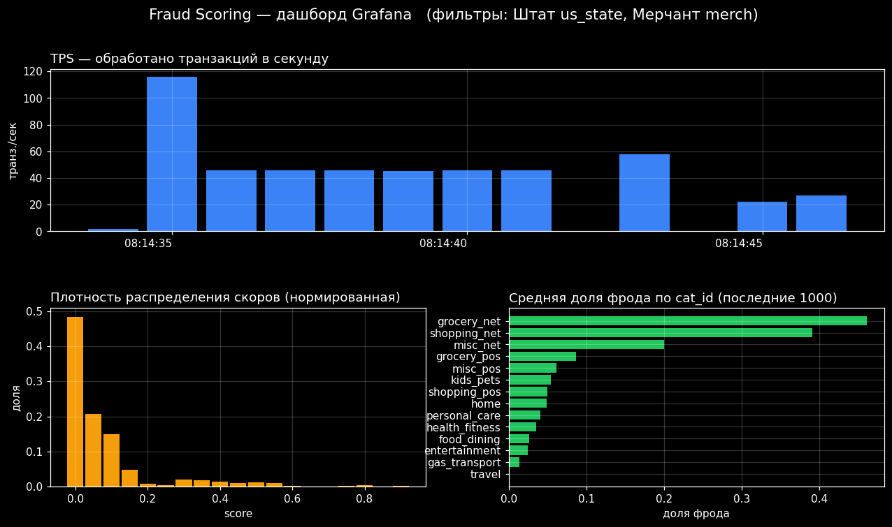

# TETA ML 2025 — потоковый фрод-скоринг (ML Ops, ДЗ 2)

[](https://github.com/dmagog/teta-ml-mlops-stream-service/actions/workflows/ci.yml)

Сервис скоринга фродовых транзакций, который работает **с потоком данных из
Kafka** (а не со статичным файлом, как в [ДЗ 1](../../ДЗ%20ML%20Ops%201)),
складывает результаты в **витрину Postgres** и визуализирует метрики в
**Grafana**. Весь стек поднимается одной командой `docker compose up --build`.

Развивает архитектуру ДЗ 1 (раздельные скрипты `препроцессинг → скоринг`,
inference **только на CPU**, упаковка в Docker), но логика переведена на
потоковую обработку транзакций.

---

## Архитектура

```
                          ┌────────────────────────────────────────────┐
   UI (Streamlit)         │                    Kafka                    │
   «Подача данных»  ─────▶ │  topic: transactions ───▶ topic: scores     │
   :8501                  │            │                      │          │
                          └────────────┼──────────────────────┼─────────┘
                                       │                      │
                              ┌────────▼────────┐    ┌─────────▼─────────┐
                              │     scorer      │    │     db_writer     │
                              │ preprocess →    │    │  scores → Postgres│
                              │ CatBoost (CPU)  │    └─────────┬─────────┘
                              │ → topic scores  │              │
                              └─────────────────┘              ▼
                                                      ┌──────────────────┐
   UI «Посмотреть результаты» ◀───────────────────────│   Postgres       │
   Grafana :3000 (дашборды)  ◀───────────────────────│ transaction_scores│
                                                      └──────────────────┘
```

| Сервис | Образ / сборка | Роль |
|--------|----------------|------|
| `kafka` | `apache/kafka:3.9` (KRaft, без ZooKeeper) | брокер, топики `transactions` и `scores` |
| `kafka-init` | `apache/kafka:3.9` | одноразовое создание топиков |
| `postgres` | `postgres:16` | витрина `transaction_scores` (схема — `db/init.sql`) |
| `scorer` | `./scorer` | Kafka(`transactions`) → препроцессинг → CatBoost → Kafka(`scores`) |
| `db_writer` | `./db_writer` | Kafka(`scores`) → запись в Postgres (идемпотентно, с переподключением) |
| `ui` | `./ui` | Streamlit: имитация потока + просмотр результатов |
| `grafana` | `grafana/grafana-oss:11.3` | дашборд с фильтрами, TPS и barplot |

### Этапы ML-пайплайна в scorer (каждый — отдельный скрипт)

| Этап | Скрипт | Что делает |
|------|--------|-----------|
| Ввод/вывод | [`scorer/src/kafka_io.py`](scorer/src/kafka_io.py) | чтение из `transactions`, запись в `scores` |
| Препроцессинг | [`scorer/src/preprocessing.py`](scorer/src/preprocessing.py) | строит признаки из сырой транзакции |
| Скоринг | [`scorer/src/scorer.py`](scorer/src/scorer.py) | CatBoost `predict_proba` на CPU → `score`, `fraud_flag` |

Оркестрация — в [`scorer/app.py`](scorer/app.py). Каждый этап можно запустить
самостоятельным скриптом (`python -m src.preprocessing ...` и т.д.).

### Соответствие колонкам фрод-датасета (sparkov)

| Поле сервиса | Колонка `test.csv` |
|--------------|--------------------|
| `transaction_id` | `trans_num` |
| `score` | вероятность фрода от модели |
| `fraud_flag` | `1`, если `score ≥ threshold` (порог в `feature_config.json`) |
| `us_state` | `state` |
| `merch` | `merchant` |
| `cat_id` | `category` |

Топик `scores` содержит обязательные поля `transaction_id, score, fraud_flag`
плюс аналитику (`us_state, merch, cat_id, amt, scored_at`) — она нужна
витрине и дашбордам Grafana.

---

## Быстрый старт

### Требования
* Docker 20.10+ и Docker Compose v2
* Docker Desktop с **≥ 6 ГБ RAM** (Kafka + Postgres + Grafana + 3 python-сервиса)
* GPU **не нужен** (inference на CPU)

### Запуск

```bash
docker compose up --build
```

Дождитесь, пока поднимется Kafka (≈30–40 с) и появятся логи `scorer`/`db_writer`
вида «Kafka consumer готов». После этого открываются:

* **UI (Streamlit):** http://localhost:8501
* **Grafana:** http://localhost:3000  (логин/пароль `admin` / `admin`)

### Шаг 1 — подать поток транзакций

1. Откройте UI → раздел **«Подача данных»**.
2. По умолчанию используется встроенный `examples/test.csv` (2000 транзакций).
   Можно загрузить свой CSV формата `test.csv`.
3. Выберите скорость (транзакций/сек) и число строк, нажмите **«Запустить поток»**.
   Транзакции уходят в топик `transactions`, `scorer` их скорит, `db_writer`
   пишет результат в Postgres.

### Шаг 2 — посмотреть результаты

UI → раздел **«Посмотреть результаты»** → кнопка **«Посмотреть результаты»**:

* последние **10 транзакций** с `fraud_flag == 1`;
* **гистограмма** скоров последних 100 транзакций.

### Шаг 3 — дашборд Grafana

http://localhost:3000 → дашборд **«Fraud Scoring — потоковый дашборд»**:

* **фильтры** по штату (`us_state`) и мерчанту (`merch`) — вверху, мультивыбор;
* **плотность распределения скоров** (с учётом фильтров);
* **TPS** — число обработанных транзакций в секунду;
* **barplot** средней доли фрода по категории `cat_id` за последние 1000 транзакций.



> Открывайте Grafana **после** подачи данных — тогда значения фильтров
> подтянутся из базы.

Остановить стек: `docker compose down` (с очисткой данных Postgres — `docker compose down -v`).

---

## Модель

Лёгкий `CatBoostClassifier` (CPU), упакован в `scorer/models/`:

* `fraud_catboost.cbm` — сериализованная модель;
* `feature_config.json` — набор/порядок фич, категориальные, порог `fraud_flag`,
  маппинг аналитических колонок.

Признаки: время (час/день недели/месяц), сумма и `log1p(сумма)`, haversine-дистанция
между держателем карты и мерчантом, возраст, население города; категориальные —
`category, merchant, state, gender, job`.

Данные **синтетические** (схема sparkov, заложен сигнал фрода): цель ДЗ — отработать
MLOps-пайплайн, а не ML, поэтому данных Kaggle не требуется и репозиторий
самодостаточен. На валидации модель даёт осмысленный сигнал (AUC ≈ 0.83), то есть
действительно применяется для подготовки результата.

### Воспроизвести модель и пример данных

```bash
python model/generate_data.py     # -> model/data/train.csv + examples/test.csv
python model/train.py             # -> scorer/models/fraud_catboost.cbm + feature_config.json
```

(зависимости — `model/requirements.txt`; артефакты уже лежат в репозитории,
переобучать не обязательно).

## Тесты

Юнит-тесты сервиса (контракт препроцессинга и инференса — защита от train/serve skew):

```bash
cd scorer
pip install -r requirements-dev.txt
python -m pytest -q
```

## Команды (Makefile)

```bash
make up      # собрать и поднять стек
make reset   # перезапуск с очисткой данных
make seed    # подать 1000 транзакций в Kafka без UI (scripts/produce.py)
make test    # юнит-тесты
make train   # пересоздать данные и переобучить модель
make down    # остановить стек
```

Для CI настроен GitHub Actions (`.github/workflows/ci.yml`): прогон юнит-тестов и
валидация `docker-compose.yml` на каждый push/PR.

## Надёжность

- **Идемпотентность:** витрина имеет `UNIQUE(transaction_id)`, а `db_writer` пишет
  с `ON CONFLICT DO NOTHING` — повторная подача `test.csv` или реплей из Kafka не
  создаёт дубликатов.
- **Микробатчинг:** `scorer` копит транзакции и скорит их одним вызовом модели
  (по размеру батча или по таймауту-linger) — эффективнее и даёт ровный TPS.
- **Устойчивый старт и работа:** `depends_on` по healthcheck + retry-циклы
  подключения; `db_writer` переподключается к Postgres при обрыве соединения.

---

## Переменные окружения

Значения по умолчанию (демо-учётки `fraud`/`admin`) заданы прямо в
`docker-compose.yml`, поэтому стек поднимается без дополнительной настройки.
Чтобы переопределить — скопируйте `.env.example` в `.env` и поменяйте значения.

| Переменная | По умолчанию | Где используется |
|------------|--------------|------------------|
| `POSTGRES_USER` / `POSTGRES_PASSWORD` / `POSTGRES_DB` | `fraud` | postgres, db_writer, ui, grafana |
| `GF_ADMIN_USER` / `GF_ADMIN_PASSWORD` | `admin` | вход в Grafana |
| `KAFKA_BOOTSTRAP` | `kafka:29092` | python-сервисы (внутри сети) |
| `TRANSACTIONS_TOPIC` / `SCORES_TOPIC` | `transactions` / `scores` | топики Kafka |
| `CATBOOST_THREAD_COUNT` | `1` | число CPU-потоков inference |

Внутри сети сервисы ходят в Kafka по `kafka:29092` (листенер `DOCKER`); с хоста —
по `localhost:9092` (листенер `HOST`).

---

## Зачёт: покрытие требований

**На «4»:**
- проект в репозитории GitHub, `docker-compose.yml` поднимает стабильный стек;
- имитация потока — через UI на Streamlit;
- сервис без ошибок читает из Kafka сообщения формата `test.csv` и пишет в Kafka `score`+`fraud_flag`;
- в сервисе есть модель, и она применяется (`CatBoostClassifier`, CPU);
- Postgres в той же сети + витрина `transaction_scores`;
- доп.сервис `db_writer` читает топик `scores` и складывает в Postgres;
- в UI раздел «Посмотреть результаты»: 10 последних `fraud_flag==1` + гистограмма скоров 100 последних.

**На «5»:**
- дашборд Grafana с фильтрами по `us_state` и `merch`;
- графики плотности скоров и TPS;
- barplot средней доли фрода по `cat_id` за последние 1000 транзакций.

---

## Порты

На хост пробрасываются:

| Порт | Сервис | Назначение |
|------|--------|-----------|
| `8501` | ui | Streamlit UI |
| `3000` | grafana | дашборд Grafana |
| `5432` | postgres | витрина (доступ с хоста) |
| `9092` | kafka | брокер, листенер `HOST` (доступ с хоста) |

Если порт занят — освободите его или поменяйте проброс в `docker-compose.yml`.
